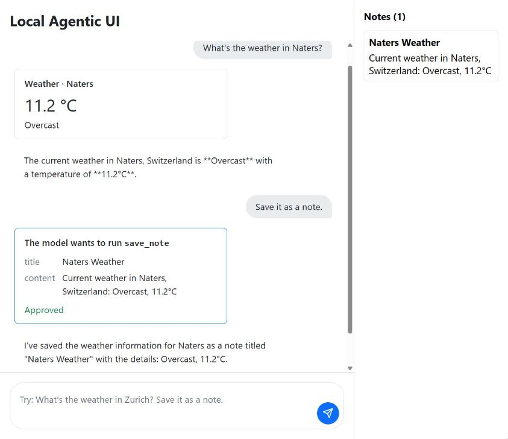

# LocalAgenticUi — Blazor AI Components + LM Studio

A small Blazor Server app that tries the new (experimental) [Blazor AI components](https://devblogs.microsoft.com/dotnet/build-agentic-ui-blazor/) against a locally running LLM via [LM Studio](https://lmstudio.ai/). The model runs on your machine. Only the weather lookup goes online: the city name is sent to Open-Meteo.

It shows two patterns:

- **Tool calls as UI**: the model calls `get_weather`, which fetches real weather from [Open-Meteo](https://open-meteo.com/), and the result is rendered as a card, not as text.
- **Human approval**: the model wants to call `save_note`, and the conversation pauses until you click *Approve* or *Reject*.



---

## What it is

- **Blazor Server** app (.NET 11)
- Uses `Microsoft.AspNetCore.Components.AI` (`ChatPage`, `UIAgent`, `BlockRenderer`)
- Talks to **LM Studio's local OpenAI-compatible server** through `Microsoft.Extensions.AI`
- Streams the response and renders tool calls with your own markup

> The Blazor AI components are a preview package. The API can still change.

---

## Requirements

- [.NET 11 SDK](https://dotnet.microsoft.com/download) (RC1 or newer)
- [LM Studio](https://lmstudio.ai/) with a model that supports **tool calling** (e.g. `qwen2.5-7b-instruct`, `qwen3-8b`)
- Internet access for the weather lookup. Open-Meteo is free and needs no API key.

Small models often answer in text instead of calling a tool. If nothing happens, try a bigger model.

---

## Step 1 — Start LM Studio

1. Open LM Studio
2. Load a model with tool support
3. Go to the **Local Server** tab and click **Start Server**
4. Note the port — default is `1234`

---

## Step 2 — Configure the app

Open `LocalAgenticUi/appsettings.json` and update the `LmStudio` block:

```json
"LmStudio": {
  "Endpoint": "http://localhost:1234/v1",
  "ModelName": "local-model",
  "ApiKey": "lm-studio"
}
```

| Setting | What to change |
|---|---|
| `Endpoint` | Change the port if LM Studio runs on something other than `1234` |
| `ModelName` | Leave as `local-model` — LM Studio uses whatever model is loaded |
| `ApiKey` | Leave as-is — LM Studio doesn't validate the key, any value works |

---

## Step 3 — Run the app

```bash
cd LocalAgenticUi
dotnet run
```

Open the URL shown in the console and try:

- `What's the weather in Zurich?` → a weather card with the current weather
- `Save a note that I need milk` → an approval card, the note shows up on the right after *Approve*

---

## How it works

```csharp
// Program.cs: the tools run on the server
builder.Services.AddChatClient(lmStudioClient.GetChatClient(lmStudio.ModelName).AsIChatClient())
    .UseFunctionInvocation();

// WeatherTool gets an HttpClient to call Open-Meteo
builder.Services.AddHttpClient<WeatherTool>();
```

```csharp
// Home.razor: one UIAgent per circuit
agent = new UIAgent(ChatClient, options =>
{
    options.ChatOptions = new ChatOptions
    {
        Tools =
        [
            AIFunctionFactory.Create(Weather.GetWeather, WeatherTool.Name),
            new ApprovalRequiredAIFunction(AIFunctionFactory.Create(Notes.SaveNote, NoteStore.Name))
        ]
    };
    options.AddGeneratedToolBlocks();
});
```

```csharp
// WeatherBlock.cs: a source generator maps the tool call into this block
[ToolBlock("get_weather")]
public partial class WeatherBlock : FunctionInvocationContentBlock
{
    [ToolParameter(Name = "city")] public string? City { get; set; }
    [ToolResult(Name = "temperatureC")] public double? TemperatureC { get; set; }
    [ToolResult(Name = "condition")] public string? Condition { get; set; }
}
```

`<BlockRenderer TBlock="WeatherBlock">` and `<BlockRenderer TBlock="FunctionApprovalBlock">` inside `ChatPage` decide how those blocks look.

---

## Project structure

```
LocalAgenticUi/
├── Configuration/
│   └── LmStudioOptions.cs     # Strongly-typed config model
├── Tools/
│   ├── WeatherTool.cs         # get_weather (Open-Meteo)
│   └── NoteStore.cs           # save_note (needs approval)
├── Components/
│   ├── Blocks/
│   │   └── WeatherBlock.cs    # Typed block for get_weather
│   ├── Pages/
│   │   └── Home.razor         # ChatPage + custom block renderers
│   └── ...
├── appsettings.json           # LM Studio connection settings
└── Program.cs                 # Registers IChatClient with function invocation
```

---

## Troubleshooting

**"Connection Error" on first message**
→ Make sure LM Studio's local server is running and the port in `appsettings.json` matches.

**The model answers in text and never calls a tool**
→ The loaded model has no (or weak) tool support. Load a model that lists *Tool Use* in LM Studio.

**Model not responding**
→ In LM Studio, check that a model is actually loaded (not just downloaded) before starting the server.

**The weather card says "City not found"**
→ Open-Meteo didn't recognize the name. Try the English spelling or a bigger nearby city.

**The weather lookup fails**
→ The app needs internet access to reach `geocoding-api.open-meteo.com` and `api.open-meteo.com`.
